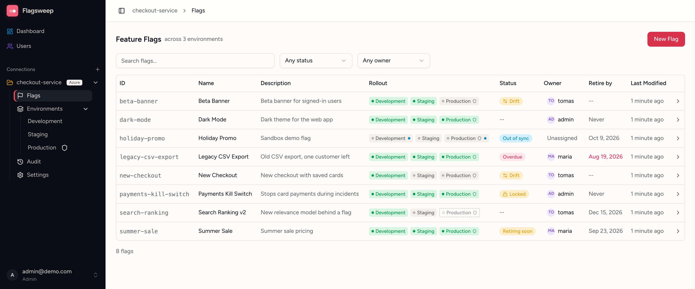

# Flagsweep

Flagsweep is a self-hosted FeatureOps layer on top of the feature flags in your cloud. Your flags stay in your cloud's store, Azure App Configuration today and AWS AppConfig soon, and Flagsweep adds what the console lacks: an attributed audit trail, drift detection, locks, protected environments, owners, and retire-by dates.



Your applications keep reading flags from your cloud's store with the SDKs they already use. Flagsweep writes to the same store, and leaves feature filters and variants set in the console as they are.

## What it does

- Shows each flag as one row with its state in every environment, and lets you change any environment from the flag's page
- Keeps an audit trail of who changed what and when, which Azure's own revision history does not record
- Marks flags changed in the cloud store directly, and flags switched differently between environments
- Protects environments so only admins can change them, and locks individual flags in the store
- Gives each flag an owner and a retire-by date, 90 days out by default
- Lets people without access to the cloud account see and change flags, with admin and member roles and link-based invitations

Azure App Configuration is supported today. AWS AppConfig is coming soon, and a hosted edition is planned.

## Quick start

```bash
docker run -d --name flagsweep \
  -p 8080:8080 \
  -v flagsweep-data:/app/data \
  ghcr.io/flagsweep-hq/flagsweep:latest
```

Open http://localhost:8080, create the admin account, and follow [Getting started](docs/guides/getting-started.md). To try it without an Azure account, run it in [sandbox mode](docs/installation/configuration.md#sandbox-mode).

## Documentation

The documentation is published at <https://flagsweep-hq.github.io/flagsweep/>. The pages live in [`docs/`](docs/), and the Docusaurus site that renders them, with the landing page and blog, is in [`website/`](website/):

- [Installation](docs/installation/index.md): the published image, a Docker build, or building from source
- [Configuration](docs/installation/configuration.md): settings, running behind a reverse proxy, data and backups
- [Connection string encryption](docs/installation/connection-string-encryption.md): encrypting the stored Azure credentials
- [Guides](docs/guides/index.md): using Flagsweep, from connecting a store to reading the audit trail

To run the site locally: `cd website && npm ci && npm start`, then open http://localhost:3000/flagsweep/.

## Development

Flagsweep is a .NET 10 API and a React 19 front end, with SQLite for its own data. [Build from source](docs/installation/dotnet.md) covers running it locally, the Azure App Configuration emulator, and the test suites.

## Releasing

Rename the `[Unreleased]` section of [CHANGELOG.md](CHANGELOG.md) to the new version and date, commit, then tag the commit `vX.Y.Z` and push the tag. The release workflow publishes the image and creates a GitHub release from that changelog section. Every push to `master` also publishes an `edge` image.

## License

Flagsweep is licensed under the [Apache License 2.0](LICENSE). You can use, self-host, modify and fork it, including inside closed-source and commercial products. Keep the license and [NOTICE](NOTICE) files when you redistribute it. The license does not cover the Flagsweep name or logo.

Pull requests are welcome. By contributing, you agree to license your contributions under the Apache License 2.0.
