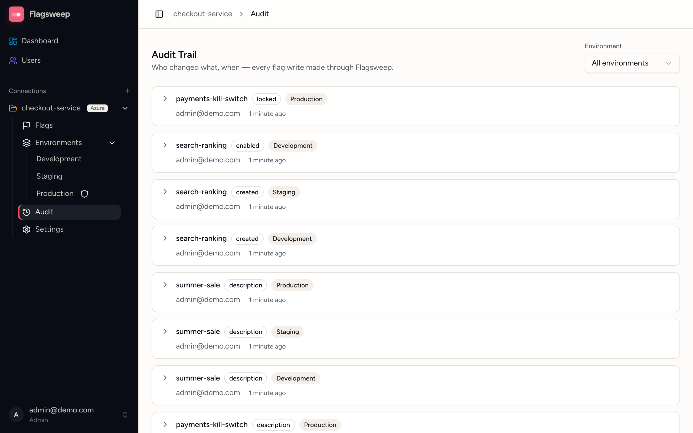

# Audit trail

The audit trail records who changed a flag, what they changed, and when. Azure's revision history records values but no actor, so Flagsweep records the signed-in user on every write it makes.

Open it from **Audit** under a connection in the sidebar. Every signed-in user can read it.

## Reading an entry

Entries are listed newest first as cards. Each card shows:

{ .screenshot }

- the flag ID,
- what changed, as a field name such as `enabled` or a count like **3 fields**,
- the environment,
- the email of the person who made the change,
- how long ago, with the exact time on hover.

Click the chevron to expand a card. The table beneath lists each field with its **From** value in red and **To** value in green. A dash means the value was empty.

Times are the store's own last-modified timestamps where Azure provides them, so they line up with what the Azure portal shows.

## What is recorded

| Field in the entry | When it appears |
|---|---|
| `created` | A flag was created. The **To** value is its initial state |
| `enabled` | A flag was toggled |
| `displayName`, `description` | Name or description edited |
| `isPermanent`, `expiresAt` | Permanent flag switched, or retire-by date changed |
| `locked` | A flag was locked or unlocked in the store |
| `deleted` | A flag was deleted |

Only fields that actually changed are recorded. Saving an edit that changes nothing writes nothing.

One entry covers one flag in one environment. A change made across environments (**Apply changes** on a flag's page, or editing or deleting the flag as a whole) is written to each environment separately, so it lands as one entry per environment, all attributed to you. A copy that is added and switched on produces two entries: the flag is created disabled, then enabled.

## What is not recorded

- Changes made outside Flagsweep. The portal, CLI, SDKs, and pipelines write straight to Azure. Those show up as an [Out of sync badge](drift-detection.md) on the flag, not as audit entries.
- Owner assignments. Ownership is Flagsweep metadata and is not currently audited.
- Administration: creating connections, environments, users, or invitations, changing a connection's connection string, and sign-ins.
- Writes to labels that are not mapped to an environment. Flagsweep only writes through environments, so in practice this does not occur.

## Filter and page

- The **Environment** select at the top narrows the list to one environment. The choice is kept in the URL, so the filtered view can be bookmarked or shared.
- Fifty entries load at a time. Click **Load more** at the bottom for older ones.

There is no search, actor filter, date filter, or export today.

## Attribution after account changes

An entry keeps its author's email after that user is deleted. If a user is restored by re-invitation, they get the same account back and their history remains theirs.

Deleting an environment deletes its audit entries. Deleting a connection deletes all of that connection's entries.

## Retention

Entries are kept indefinitely in Flagsweep's database. Back up the data volume as described in [Data and backups](../installation/configuration.md#data-and-backups) if the history matters to you.
