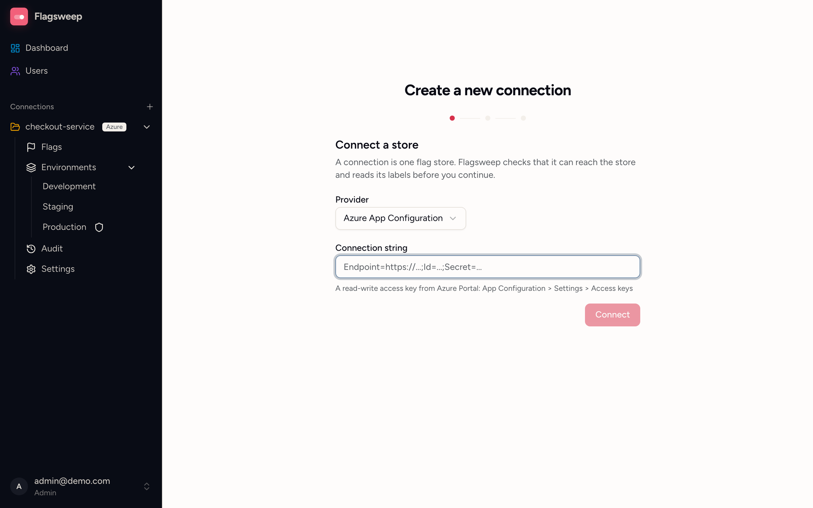

# Connect Azure App Configuration

Each connection is one Azure App Configuration store. You connect the store when you create the connection, by pasting its connection string, and Flagsweep uses that string to read and write the store's feature flags. Only admins can create connections or see and change their connection.

Connection strings are encrypted at rest when the installation has a secret key configured, and stored in plain text otherwise; see [Connection string encryption](../installation/connection-string-encryption.md). The store's endpoint (for example `https://<store>.azconfig.io`) is not secret, so it is stored in plain text; Flagsweep uses it to recognise a store it already knows. Flagsweep never writes anything to the store except the feature flag settings you change through the UI.

## What you need

Flagsweep authenticates to the store with its **access keys**: the read-write connection string that Azure generates for every App Configuration store. It looks like `Endpoint=https://<store>.azconfig.io;Id=...;Secret=...`.

Flagsweep writes flags and can set the store's read-only lock, so it needs write access. Use a key from the **Read-write keys** section, not a read-only one.

:::note[Other credential types]

Entra ID credentials such as service principals and managed identities are not supported yet. If you need them, open an issue on GitHub describing your hosting setup.

:::

## Connect a store

1. In the Azure portal, open your App Configuration store.
2. Go to **Settings > Access keys**.
3. Under **Read-write keys**, copy a **Connection string**.
4. In Flagsweep, click the **+** next to **Connections** in the sidebar (or go to `/new-connection`).
5. Paste the string into **Connection string** and continue.

{ .screenshot }

Flagsweep connects to the store before it lets you continue, and reads its labels so the next steps can offer them as environments. [Connections and environments](connections-and-environments.md#create-a-connection) walks through the rest of the wizard.

If the check fails you see the error returned by Azure. Common causes:

- **401 or 403**: the key is wrong, has been regenerated in Azure, or is a read-only key.
- **Endpoint not found**: check the endpoint URL. It must be the `azconfig.io` endpoint, not the portal URL.
- **Timeout**: a firewall or private endpoint is blocking Flagsweep. Flagsweep waits at most about 20 seconds per call.
- **Connection string must include a valid Endpoint**: the pasted text is not a connection string. Copy the whole value from **Access keys**, starting with `Endpoint=`.

### One connection per store

A store can be connected only once. If you paste a connection string for a store that is already connected, Flagsweep stops with "This store is already connected as '...'." Open that connection instead. Two connections on the same store would show exactly the same flags.

Stores are matched by endpoint, so this applies even when the second string uses a different access key for the same store.

## Test the connection

Open the connection's **Settings** and find the **Store** section. It shows the store's endpoint. Click **Test connection**. A green result reads "Connected successfully. Found N label(s)." A red result shows the error returned by Azure; the causes are the same as above.

## Rotate access keys

When you regenerate a key in Azure, give Flagsweep the new one before the old one stops working:

1. In the Azure portal, copy the other read-write connection string (or the regenerated one).
2. In Flagsweep, open the connection's **Settings** and, in the **Store** section, choose **Replace connection string**.
3. Paste the new string and save.

The connection keeps its environments, owners, and audit history. The new string can point at a different store, but not at one that another connection already uses.

## Remove a store

Deleting the connection removes the store from Flagsweep. See [Rename or delete a connection](connections-and-environments.md#rename-or-delete-a-connection). Your store and its flags are untouched.

## Local development

You do not need an Azure account to develop against Flagsweep. [Build from source](../installation/dotnet.md) describes the floci emulator and the connection string to use with it.
