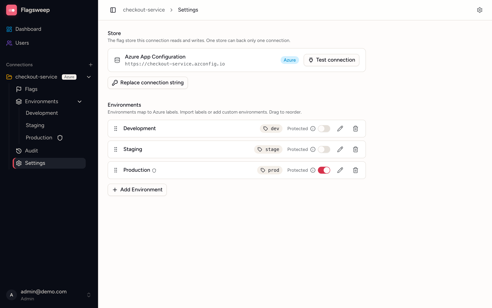

# Connections and environments

A **connection** is one Azure App Configuration store: one application's set of flags, and the connection string Flagsweep uses to reach them. An **environment** is a named view onto that store, mapped to one Azure App Configuration label. Environments are what a flag's rollout is measured across, and what you protect.

## How environments map to Azure labels

Azure App Configuration has no concept of environments. It has labels: a free-text tag on each key-value. The common convention is one label per environment (`dev`, `staging`, `prod`), and Flagsweep builds its environments on that convention.

- An environment with label `prod` shows the flags whose label is `prod`, and writes go to that label.
- An environment with **No label** shows flags in the store's default, unlabelled space.
- Flagsweep never invents labels. Creating a flag in an environment writes the key with that environment's label.

A connection covers exactly one store. If you use a separate App Configuration store per environment instead of labels, each store becomes its own connection, and those environments cannot appear in one flag's rollout or in one connection's drift view.

Environment definitions live only in Flagsweep. Adding, renaming, or deleting an environment changes nothing in Azure.

## Create a connection

Only admins can create connections, because creating one means handing Flagsweep the store's credentials.

1. Click the **+** next to **Connections** in the sidebar, or go to `/new-connection`.
2. Paste the store's read-write **Connection string** and continue. Flagsweep connects to the store and reads its labels. See [Connect Azure App Configuration](connect-azure-app-configuration.md) for where to find the string and what the errors mean.
3. Enter a **Connection name** (up to 100 characters). It is prefilled with the Azure store name. Click **Next**.
4. Define environments:
   - **Discovered labels** lists every label found in the store. Tick the ones you want. Each becomes an environment named after the label.
   - **Custom environments** lets you type an **Environment name** and an optional **Label**, then click **Add**. Leave the label empty for the unlabelled space. Use this for labels that do not exist yet, or when you want a friendlier name than the label.
   - Environment names must be unique within the connection.
5. Click **Create connection**.

Each store can be connected only once. If the store is already connected, Flagsweep stops at step 2 with "This store is already connected as '...'."

The order you add environments in becomes their sort order. You can change it later.

## Connection settings

Open **Settings** under the connection in the sidebar (admins only). The page has two sections: **Store** and **Environments**.

### Store

Shows the endpoint of the store this connection points at.

- **Test connection** checks that Flagsweep can still reach the store with the saved credentials.
- **Replace connection string** swaps in new credentials, for example after you regenerate the store's access keys. See [Rotate access keys](connect-azure-app-configuration.md#rotate-access-keys).

{ .screenshot }

### Add an environment

1. Click **Add Environment**.
2. Choose **Import from labels** to pick a label that is not mapped yet, or **Add custom** to enter a name and an optional label.
3. Click **Add Environment**.

### Rename an environment or change its label

Click the pencil on the row, edit **Name** or **Label**, and press Enter or the check mark. Changing the label repoints the environment at a different set of flags in the store. The flags themselves do not move.

### Reorder environments

Drag the grip handle at the left of a row. The order is saved immediately. It controls:

- the order of environments in the sidebar,
- the order of the chips in a flag's rollout strip,
- which environment counts as the **baseline** for drift. The last environment in the order is the baseline, so an order of Dev, Staging, Prod compares Dev and Staging against Prod. This applies to the dashboard's connection cards and to every flag's **Drift** badge.

### Protect an environment

Turn on the **Protected** switch on a row. Only admins can then create, toggle, edit, or delete flags in that environment. Members see the flags but cannot change them. See [Locks and protected environments](locks-and-protection.md).

Protection is enforced by label, so an environment with **No label** cannot be protected effectively. Give production a label.

### Delete an environment

Click the trash icon and confirm with **Delete environment**. Only the Flagsweep mapping is removed. Every flag under that label stays in Azure exactly as it was.

The audit entries recorded for that environment are deleted with it. If you only want to hide an environment temporarily, leave it in place; there is no way to recover its history afterwards.

## Rename or delete a connection

There is no UI for this yet. Admins can rename with `PUT /api/connections/{id}` or delete with `DELETE /api/connections/{id}`. Deleting a connection removes its environments, ownership records, audit history, and saved connection string from Flagsweep. It does not touch Azure. Once the connection is gone, the store can be connected to a new connection.

## Find an environment quickly

Press **Cmd+K** (or **Ctrl+K**) anywhere. Type part of a connection or environment name and pick a result to jump to its flag table.
