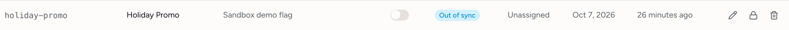
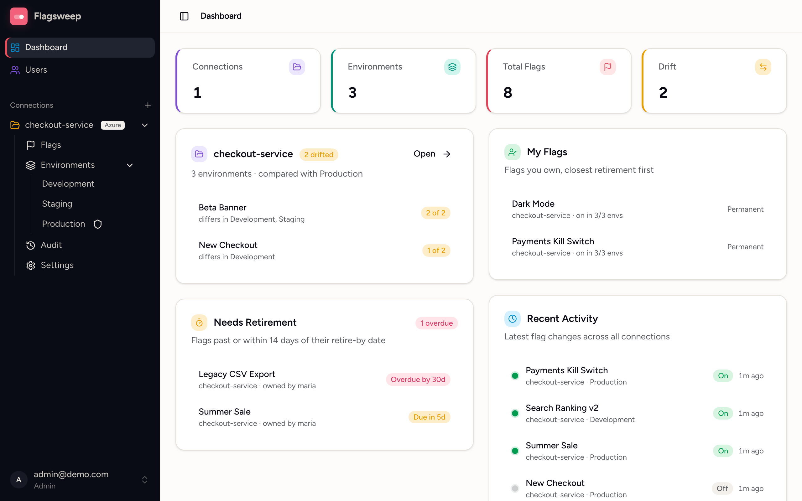

# Out of sync and drift

Every change made through Flagsweep is attributed and audited. Two signals tell you when a flag has moved away from that record, in different ways.

- **Out of sync**: the store and Flagsweep's record of it disagree, because someone wrote to Azure directly. It catches the changes the audit trail cannot see.
- **[Drift](#drift-environments-that-have-moved-apart)**: environments have moved apart from each other. This is usually harmless, and is covered at the end of this guide.

## The Out of sync badge on a flag

A blue **Out of sync** badge in a flag's **Status** column means the flag was changed in Azure App Configuration after Flagsweep's last write to it. Hovering shows "Changed in the cloud store since Flagsweep's last write".

The badge appears in both flag tables. On the connection's **Flags** page it covers the flag anywhere in the connection, and the hover text names the environments it applies to; a small blue dot on a rollout chip marks which ones. On an environment's own table it is about that environment alone.

{ .screenshot screenshot--row }

### How it is computed

Every time Flagsweep writes a flag, it records the store's own last-modified timestamp for that key and label. When it lists flags, it compares the store's current timestamp with the one it recorded:

- **Newer than recorded**: something else wrote the flag. The badge shows.
- **Same**: no external change.
- **No record**: Flagsweep has never written this flag, so it cannot tell. No badge is shown. This is normal for flags that already existed when you connected the store.

Timestamps come from Azure itself, so Flagsweep's own clock does not matter.

### What to do when you see it

1. Open the flag in the Azure portal, or check your deployment pipeline, to see what changed and why.
2. Decide whether the external change is the intended state.
3. Make any write to the flag through Flagsweep, such as toggling it to the intended value or saving its description. That records a fresh timestamp and clears the badge.

There is no dismiss button. The badge clears only when Flagsweep writes the flag again, because a write is the only point at which it learns the store's current state.

### What it does not tell you

- Who made the external change. Azure's revision history has no actor; use Azure's activity log or Log Analytics if you need that.
- What changed. Compare the current values with the last audit entry for the flag.
- Changes made before Flagsweep's first write to a flag.

External changes never appear in the audit trail, which only records writes made through Flagsweep. The badge is how you find out about them.

### Preventing it

Out-of-sync detection only observes. To prevent out-of-band changes, lock individual flags in the store or restrict who has data-plane access to your App Configuration store in Azure. See [Locks and protected environments](locks-and-protection.md).

## Drift: environments that have moved apart

Drift is a separate signal from Out of sync. The dashboard's **Drift** stat, the amber **Drift** badge in a flag's Status column, and each connection's card count flags whose enabled state differs between two environments of the same connection. A flag that is on in Staging and off in Production has drifted.

{ .screenshot }

Drift between environments is usually intentional, since features roll through them over time. Treat the count as a list of changes not yet promoted, or of flags left on in a lower environment.

### How it is compared

The last environment in the connection's order (normally Production) is the **baseline**, and every other environment is compared against it. A flag counts as drifted when it exists in both and is switched differently. A flag missing from an environment has not been promoted yet, so it does not count as drift.

Each connection's card lists the drifted flags themselves, most-drifted first, with the environments that disagree and how many of them, for example "differs in dev, uat · 2 of 4". Clicking one opens that flag's page, where you can see and fix the rollout in one place. The card shows the first five; the badge opens the rest.

Counting is per flag, not per environment pair, so the connection's badge and the **Drift** stat can never exceed the number of flags you have. Click either to open the connection's Flags page filtered to those flags. Change which environment is the baseline by reordering environments in the connection's **Settings**. The last one is the baseline.

### Working through it

The [Flags page](flags-across-environments.md) shows every environment as a rollout strip per flag, so a drifted flag reads at a glance: which environments are on, which are off, and which do not have it at all. The same amber **Drift** badge appears in its **Status** column, and **Any status > Drift** narrows the list to the drifted ones.

Open a flag and its **Rollout** section shows every environment together, so you can close the gap from that one page.
