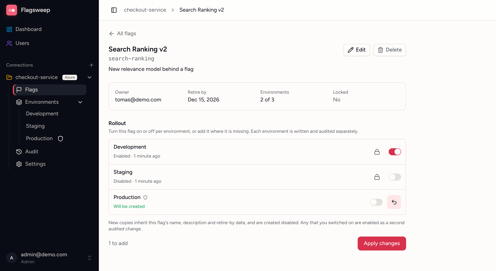

# Flags across environments

In Azure App Configuration a flag is stored as a separate copy in every environment. The **Flags** page shows each flag in the connection as one row, with its state in every environment.

Open it from **Flags** under a connection in the sidebar. It is also where a connection opens by default.

## Reading the list

{ .screenshot }

Each row shows the flag's name and ID, its description, and a **rollout strip**, with one chip per environment in the connection's own order:

- A filled green chip means the flag is **enabled** there.
- A grey chip means it exists but is **disabled**.
- A dashed outline means the flag is **not set** in that environment at all.
- A shield on a chip marks a protected environment; a small blue dot marks a copy that was changed outside Flagsweep.

The remaining columns are about the flag as a whole: its **Status**, its **Owner**, its **Retire by** date, and the most recent write to any of its copies.

### The Status column

The **Status** column shows what needs attention. A flag can carry more than one badge, and `--` means it carries none:

| Badge | Meaning |
|---|---|
| **Out of sync** | The store was written to outside Flagsweep. See [Out of sync and drift](drift-detection.md) |
| **Drift** | The flag is switched differently from the baseline environment |
| **Locked** | The flag is locked in the store, in at least one environment |
| **Overdue** | Its retire-by date has passed |
| **Retiring soon** | Its retire-by date is within 14 days |
| **Owner deleted** | Its owner's account was removed, so it needs reassigning |

Hover any badge for the detail, such as which environments it applies to or how overdue the flag is.

### Narrowing the list

- **Search flags...** matches the ID, name, description, and owner email.
- **Any status** filters to one badge. Only badges some flag actually carries are offered, so the filter never leads to an empty list. The dashboard links in here: a connection's **N drifted** badge, and its **Drift** and **N overdue** counts where they all belong to one connection, open this page already filtered.
- **Any owner** filters to one person, or to **Unassigned**.

## Toggling one environment from the list

A chip is also a switch. Click a filled or grey chip to flip that one environment, confirm, and the write goes straight to Azure. It is the same single, audited change as toggling from the environment's own table.

Chips that cannot be clicked say why on hover: the flag is **not set** there, the environment is **protected** and you are not an admin, or the flag is **locked in the store**. For anything more than a single flip, such as adding the flag where it is missing, changing several environments at once, or locking and unlocking, open the flag.

## Creating a flag

**New Flag** on this page creates a flag at the connection level, so you choose its environments in the dialog. Tick every environment the flag should exist in; it is created in each with the same name, description, owner and retire-by date, and always disabled. You land on the new flag's page afterwards.

Protected environments are not selectable unless you are an admin, and the button is unavailable altogether if there is no environment you may write to.

## Opening a flag

Click a flag's name, or the chevron at the end of its row, to open it on its own page. The page shows what is true connection-wide (owner, retire-by date, how many environments hold it, and where it is locked), then a **Rollout** section with one row per environment.

{ .screenshot }

From there you can:

- Switch any environment on or off.
- Add the flag where it is missing. The new copy inherits the flag's name, description and retire-by date, and is created disabled.
- Lock or unlock the flag in one environment, via the padlock on that row. Admins can always do this, and so can the flag's owner. A lock is held per environment, so a flag can be frozen in production while still editable in dev.
- See why an environment is read-only: protected environments are editable by admins only, and a flag locked in the store cannot be changed at all.
- Read when each environment was last written, beside its current state.

Nothing is written, locks included, until you press **Apply changes**. The line beside the button counts what is queued, as in "1 to add, 2 to toggle, 1 to unlock". Each environment is then written separately, so the audit trail records one entry per environment, attributed to you. Because flags are always created disabled, a copy you add and switch on is enabled as a second, separately audited change.

Within one apply, locks are released first and applied last, with the value changes in between. That means you can unlock an environment and change its value in the same pass, and you can change a value and then lock it behind you.

## Editing and deleting a flag

**Edit** on the flag's page changes what belongs to the flag rather than to one environment: its name, description, owner, permanence and retire-by date. The change is written to every environment that holds a copy, so the flag does not end up with different names in different places. Owners can also be reassigned straight from the **Owner** column in the flag list, since ownership is connection-wide.

**Delete** removes the flag from Azure App Configuration in every environment that holds it. This is permanent: there is no recycle bin and no tombstone, and any application still reading the flag falls back to its own default. Flagsweep keeps the audit history, so you can still see who deleted it and when.

Both are refused when any copy sits somewhere you cannot write: a protected environment if you are not an admin, or an environment where the flag is locked. Because they touch every copy, they are refused rather than applied halfway. The buttons are disabled and a note above the rollout names the environments in the way and what to do about them: release the lock on the rollout row below and apply, or ask an admin.

## When to use an environment's own table

The **Environments** group in the sidebar leads to each environment's own flag table. Changes to a flag as a whole happen on the Flags page and the flag's own page. An environment's table is for checking what is in that one environment, with a one-click toggle per row and a confirmation before each write.
