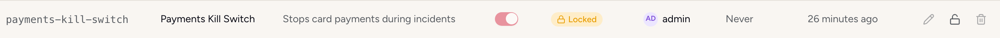
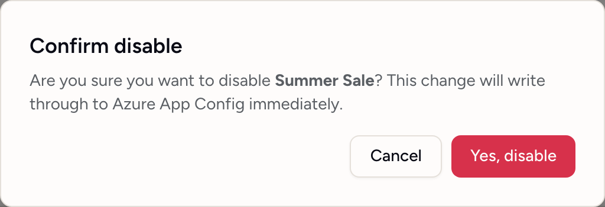

# Locks and protected environments

Flagsweep has two guards that stop a flag from being changed, and they work at different levels.

| | Lock | Protected environment |
|---|---|---|
| Applies to | One flag, in one environment | Every flag in an environment |
| Stops whom | Everyone, including admins and anything else writing to the store | Members only. Admins can still change flags |
| Where it lives | In Azure App Configuration, as the setting's read-only lock | In Flagsweep |
| Who can set it | Admins, and the flag's owner | Admins |

## Lock a flag

A lock is Azure App Configuration's own read-only lock on the setting. While it is set, the store rejects every write to that key and label, whether the write comes from Flagsweep, the Azure portal, the CLI, or a pipeline. Use it for flags that must not move, such as a kill switch during an incident or a flag whose value is contractually fixed.

{ .screenshot screenshot--row }

1. Open an environment's flag table as an admin, or the flag's own page as an admin or its owner.
2. Click the padlock (**Lock flag in the store**). On a flag's page the padlock sits on each environment's rollout row, and the change is staged until you press **Apply changes**.

The flag's **Status** column now reads **Locked**, and the switch, pencil, and trash are disabled for everyone. Attempts to write return "This flag is locked in the store. Unlock it to make changes." Owner assignment still works because it does not touch the store.

To unlock, click the same padlock (**Unlock flag in the store**). Lock and unlock are recorded in the audit trail as changes to a `locked` field.

Admins can always lock and unlock a flag, from either table. So can the flag's owner, which lets the person accountable for a flag release their own kill switch without waiting for an admin. An owner who is not an admin does this from the flag's own page. Everyone else is refused with "Only an admin or the flag's owner can change its lock."

Protection still wins: a member who owns a flag in a protected environment cannot lock or unlock it there, because members write nothing in a protected environment whatever they own.

A lock protects against accidental writes. Anyone who can set it can also release it, and someone holding the store's access keys can clear it in the Azure portal, so it will not keep out a determined admin or owner. It does stop writes that were never meant to touch the flag, such as a pipeline, a script, or another service using the App Configuration SDK, because releasing the lock has to be done on purpose and every release is attributed in the audit trail.

Locks set in the Azure portal show up the same way. Flagsweep reads the store's lock state on every listing.

Locking is per label. A flag locked in production is still editable in staging.

## Protect an environment

Protection is a Flagsweep rule: in a protected environment only admins can create, toggle, edit, or delete flags. It is the usual setting for production: the whole team can see the environment, and only admins can change it.

{ .screenshot screenshot--dialog }

1. Open the connection's **Settings** as an admin.
2. Turn on the **Protected** switch on the environment's row.

What changes:

- A shield marks the environment: beside it in the sidebar, next to **Feature Flags** in its page header, on its chip in every rollout strip, and beside its row on a flag's page. A shield always means a protected environment; a padlock always means a flag locked in the store.
- In the environment's own table, members see the banner "This environment is protected. Only admins can modify flags." The **New Flag** button, switches, and row actions are disabled for them, including the owner picker.
- In the flag-first views, a member cannot tick that environment when creating a flag, its rollout chips do not respond to clicks, and its row on a flag's page is read-only and says so.
- If a member's request reaches the API anyway, it is refused with "This environment is protected. Admin role required."
- Admins still get the same confirmation dialog before every toggle.

Protection is enforced by the environment's Azure label. An environment with **No label** cannot be protected. Map production to a label.

Protection does not affect writes made outside Flagsweep. To stop those, lock the individual flags or restrict access to the store in Azure.

## Choosing between them

- **Nobody should change this flag right now**: lock it.
- **Only admins should change flags here**: protect the environment.
- **Changes made around Flagsweep should be visible**: neither prevents that, but the [Out of sync badge](drift-detection.md) surfaces it.
