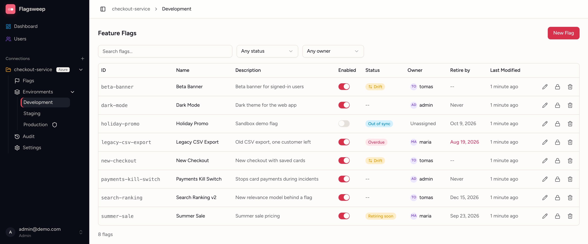
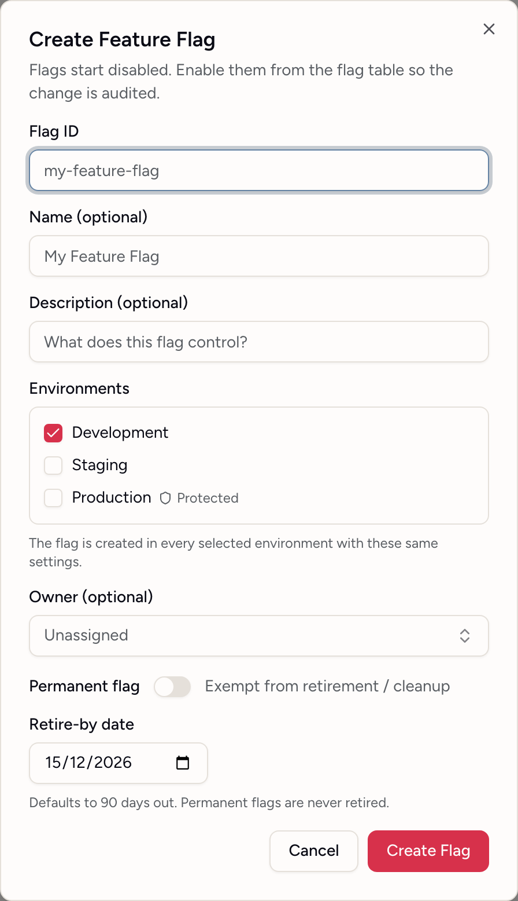
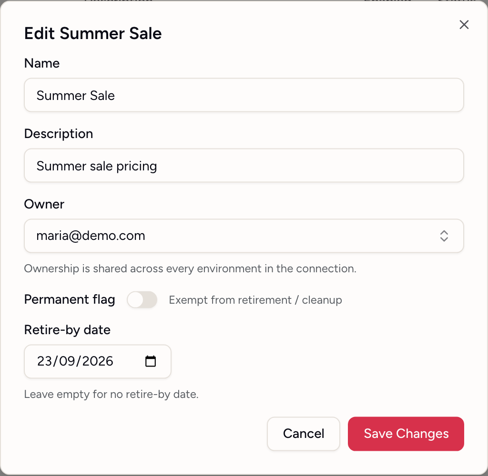
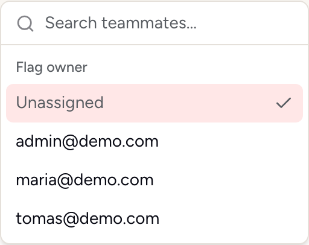

# Managing flags

Flagsweep manages boolean feature flags stored in Azure App Configuration. Every change you make here is written to the store immediately, and your applications read it through the normal App Configuration SDKs. Feature filters and variants configured in Azure are preserved on every write; Flagsweep only changes the fields it exposes.

Open a flag table by clicking an environment under a connection in the sidebar. The table shows one environment at a time. To see all environments at once, use the connection's [Flags](flags-across-environments.md) page.

## The flag table

{ .screenshot }

| Column | Meaning |
|---|---|
| **ID** | The flag's key in the store, without the `.appconfig.featureflag/` prefix |
| **Name** | Display name |
| **Description** | Free text, up to 1000 characters |
| **Enabled** | The on/off switch |
| **Status** | Lifecycle labels: **Out of sync**, **Drift**, **Locked**, **Overdue**, **Retiring soon**, **Owner deleted**. Hover any badge for detail; `--` means nothing to flag |
| **Owner** | The accountable person, or **Unassigned** |
| **Retire by** | The date the flag should be removed, **Never** for permanent flags |
| **Last Modified** | When the store last recorded a write, from any source |

Here the badges are about this environment's copy. **Drift** compares it with the connection's baseline environment (the last one in the connection's order), so it never appears in the baseline's own table. The full list of badges is in [Flags across environments](flags-across-environments.md#the-status-column).

Above the table: **Search flags...** matches any visible text including owner email. The status filter offers **Any status** and each badge present in the table. The owner filter offers **Any owner**, **Unassigned**, and each owner present.

Flags already in the store appear automatically. Flagsweep does not need to know about a flag before it can manage it.

## Create a flag

1. Click **New Flag**.
2. Fill in the dialog:
   - **Flag ID** (required, up to 200 characters). Letters, digits, dots, hyphens, and underscores.
   - **Name** and **Description** (optional). With no name, the ID is used.
   - **Environments**: the environment you are viewing is ticked; tick any others you want the flag in. All selected environments get the same ID, name, description, owner, and retire-by date.
   - **Owner** (optional).
   - **Permanent flag**: on for flags that are never meant to be retired, such as kill switches or operational toggles.
   - **Retire-by date**: prefilled to 90 days from today. Clearing it still results in the 90-day default; only **Permanent flag** removes the date.
3. Click **Create Flag**.

{ .screenshot screenshot--dialog }

Flags are always created disabled, in every environment you selected. Enabling one is a separate, confirmed action so that it lands in the [audit trail](audit-trail.md) as a deliberate change.

The **Environments** list shows every environment in the connection. A [protected](locks-and-protection.md) environment is marked; members see it as **Admins only** and cannot tick it. If the selection includes an environment you are not allowed to write to, the whole request is refused and nothing is created anywhere.

You can also create a flag in one environment at a time. To find flags that exist in some environments but not others, look for the dashed chips on the connection's [Flags](flags-across-environments.md) page.

## Toggle a flag

1. Click the switch in the **Enabled** column.
2. Read the confirmation and click **Yes, enable** or **Yes, disable**.

The row shows **Deploying** while the write is in flight, then settles. If the write fails you see a toast with the reason and the switch reverts. Common reasons: the flag is locked, the environment is protected and you are a member, or the connection's connection string no longer works.

## Edit name, description, or retirement

1. Click the pencil icon on the row (**Edit flag details**).
2. Change **Name**, **Description**, **Owner**, **Permanent flag**, or **Retire-by date**.
3. Click **Save Changes**.

{ .screenshot screenshot--dialog }

The flag ID and the enabled state cannot be changed in this dialog. Turning **Permanent flag** on removes the retire-by date. Turning it off again lets you set a new date; leaving it empty means no date.

This dialog edits this environment's copy, which is why a flag can end up named differently in different environments. To change the name, description or retirement everywhere at once, use **Edit** on the flag's own page instead. See [Flags across environments](flags-across-environments.md#editing-and-deleting-a-flag).

## Assign an owner

Click the **Owner** cell, search for a teammate, and pick them, or choose **Unassigned**. The same picker is in the **Owner** field of the create and edit dialogs, so you can set ownership while you are already editing a flag.

Ownership is recorded per flag, not per environment: a flag has one owner across all of the connection's environments, so assigning an owner in one environment assigns it everywhere.

{ .screenshot screenshot--small }

- Ownership is stored only in Flagsweep. It does not write to Azure, so it works on locked flags too.
- Any member can assign owners. In a protected environment's table the picker is disabled for members; use the connection's [Flags](flags-across-environments.md) page instead, where the **Owner** column is about the flag rather than one environment.
- Owners see their flags on the dashboard under **My Flags**, ordered by nearest retirement.
- If an owner's account is deleted, the cell reads **Deleted user** until someone reassigns it.

## Retire-by dates

Every non-permanent flag carries a retire-by date, 90 days out by default. It is only a reminder: Flagsweep never disables or removes a flag automatically.

- The **Retire by** column turns red once the date has passed.
- The dashboard's **Needs Retirement** card lists flags that are overdue or due within 14 days, across all connections.
- When a flag has served its purpose, remove it from your code, then delete it here.
- For flags that should stay forever, set **Permanent flag** so they never appear in retirement lists.

## Delete a flag

1. Click the trash icon on the row.
2. Confirm with **Delete permanently**.

This removes the key from Azure App Configuration for the current environment's label. It is not recoverable from Flagsweep. Your application will fall back to whatever it does when the flag is absent, so remove the code path first. The deletion is recorded in the audit trail.

Copies of the flag under other labels are unaffected. Delete them from each environment separately, or use **Delete** on the flag's own page to remove every copy at once. See [Flags across environments](flags-across-environments.md).

## Restrictions you may hit

- **Locked flag**: the switch, pencil, and trash are disabled. An admin must unlock it first, or its owner from the flag's own page. See [Locks and protected environments](locks-and-protection.md).
- **Protected environment**: members see an amber banner and cannot change anything. An admin can make the change or unprotect the environment.
- **Out of sync badge**: the flag was changed outside Flagsweep. Check what changed before you write over it. See [Out of sync and drift](drift-detection.md).
