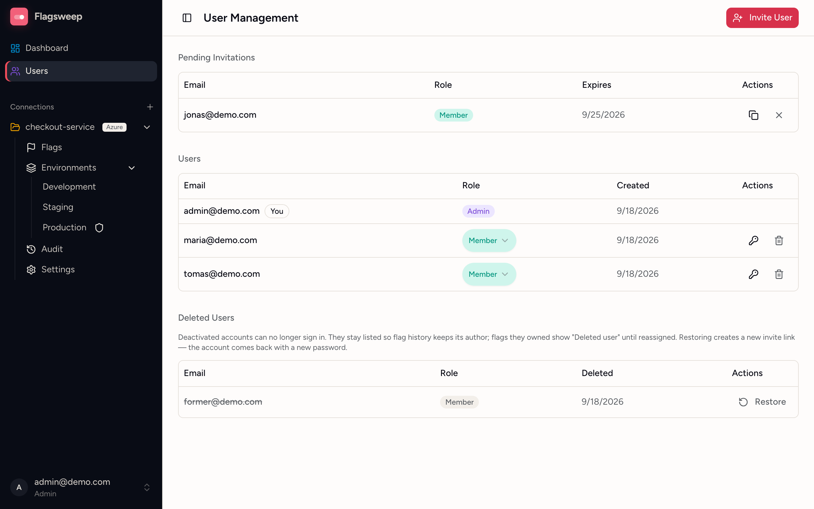
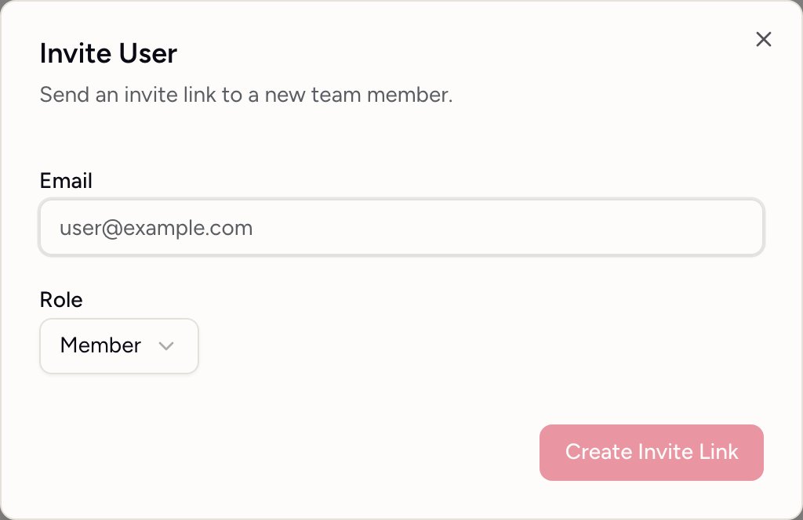

# Team and access

Flagsweep is for people who need to see or flip flags but do not have access to the Azure resource, such as product managers, QA and support. They sign in to Flagsweep with an email and password, and Flagsweep talks to Azure on their behalf with the connection's saved connection string.

One Flagsweep instance is one team. All users see all connections.

## Roles

| | Member | Admin |
|---|---|---|
| View everything | yes | yes |
| Change flags in unprotected environments | yes | yes |
| Change flags in protected environments | no | yes |
| Assign flag owners | yes | yes |
| Create connections | no | yes |
| Connection settings: store, environments, protection | no | yes |
| Lock and unlock flags | no | yes |
| Users, invitations, roles, password resets | no | yes |

{ .screenshot }

The first account created at `/setup` is an admin. The **Users** page, the **+** for creating a connection, and each connection's **Settings** only appear in the sidebar for admins.

## Invite a user

Flagsweep does not send email. Invitations are links you copy and pass on.

{ .screenshot screenshot--dialog }

1. Open **Users** and click **Invite User**.
2. Enter the **Email** and choose a **Role**.
3. Click **Create Invite Link**.
4. Copy the link from the dialog and send it to the person through whatever channel you trust.

The invitee opens the link, sees their email and role, sets a password, and is signed in. Links expire after 7 days and can be used once. You cannot invite an email that already has an account or an active invitation.

**Pending Invitations** lists open invites with their expiry. The copy icon retrieves the link again; the **X** revokes it immediately. Expired invitations disappear from the list on their own.

## Change a role

On the **Users** page, pick **Member** or **Admin** in the row's **Role** select. It saves immediately.

Two rules apply: you cannot change your own role, and the last remaining admin cannot be demoted.

## Remove a user

1. On the **Users** page, click the trash icon on the row.
2. Confirm with **Delete**.

The account can no longer sign in, but it is kept in the **Deleted Users** section so that:

- audit entries still show the person's email,
- flags they owned show **Deleted user** in the **Owner** column until someone reassigns them.

You cannot delete yourself, and you cannot delete the last admin. Reassign flags owned by a departed teammate from the **Owner** column, or use the owner filter set to that person to find them all.

## Restore a user

In **Deleted Users**, click **Restore**. This creates a new invite link for the same email and role. When the person accepts it and sets a new password, the original account is reactivated with the same identity, so their audit history and flag ownership reconnect automatically.

## Passwords

Passwords must be at least 6 characters by default. Administrators can require more length, digits, or symbols with the `Auth__Password__*` settings described in [Configuration](../installation/configuration.md).

### Change your own password

Click your email at the bottom of the sidebar and choose **Change password**. Enter your current password and the new one twice, then click **Change Password**.

### Reset someone else's password

Only admins can do this, and only for other users.

1. On the **Users** page, click the key icon on the user's row (**Reset password**).
2. Copy the link from the **Password Reset Link** dialog and send it to the user.

The user opens the link, sets a new password, and signs in. Reset links are single-use.

There is no self-service "forgot password" flow. If the only admin loses their password, nobody in the UI can issue a reset link. Keep at least two admins.

## Sign out

Click your email at the bottom of the sidebar and choose **Sign out**.
